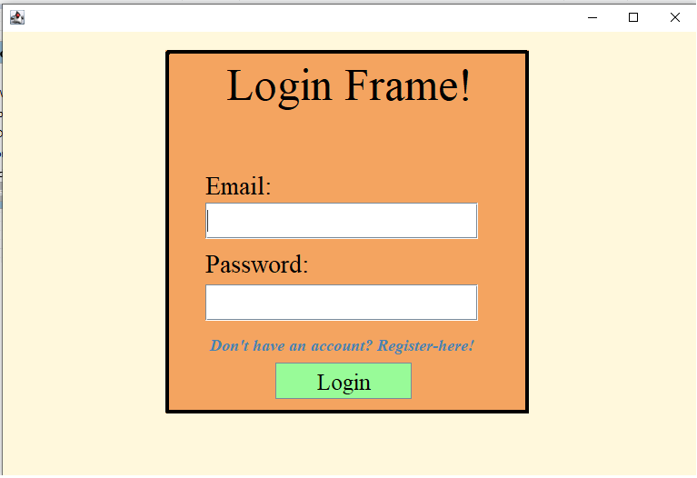
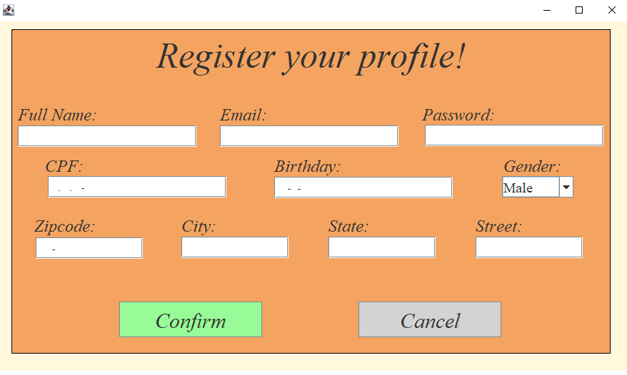
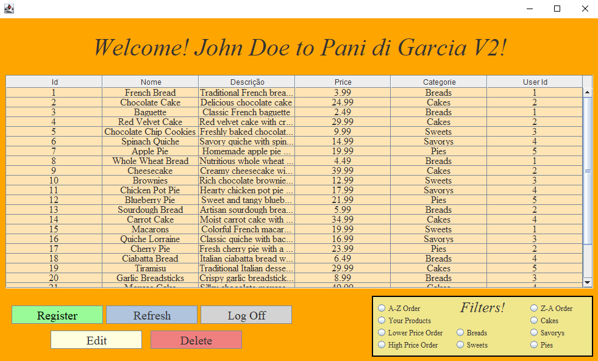
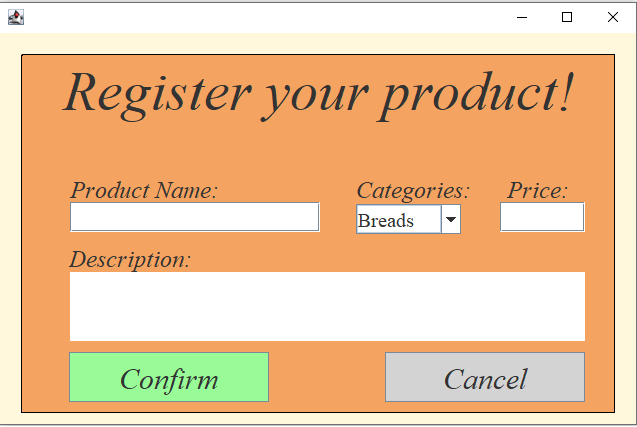
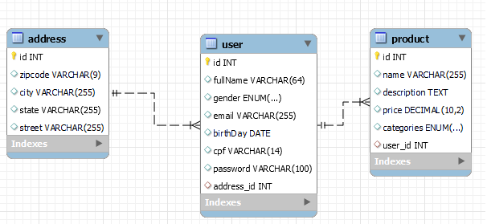

# Pani di Garcia V2

Esta aplicação Java Swing inclui um frame principal com botões para registrar usuários, registrar produtos e fazer login. Ela fornece uma interface gráfica simples para interações dos usuários.

O nome da aplicação é **Pani di Garcia V2** e ela é destinada para login, registro de usuário, listar produtos, editar, deletar e criar produtos.

## Funcionalidades

- **Frame de Login**: Permite que os usuários façam login com um nome de usuário e senha.

- **Frame de Registro**: Permite que os usuários se registrem com um nome de usuário e senha.


- **Frame Principal**: Fornece botões para navegar para formulários de registro, registro de produtos e login.


- **Frame de Registro de Produto**: Permite que os usuários registrem produtos com um nome e preço.



## Pré-requisitos

- Java Development Kit (JDK) 8 ou superior
- Um IDE como IntelliJ IDEA, Eclipse ou NetBeans
- O MySQL Workbench para popular o banco de dados


### Clonando o Repositório

```bash
git clone https://github.com/glautonOsorio/PaniDiGarciaV2-Java-Swing.git
cd PaniDiGarciaV2-Java-Swing
```

### Compilando e Executando

1. Abra o projeto no seu IDE Java preferido.
2. Certifique-se de definir a versão do JDK para 8 ou superior.
3. Compile o projeto.
4. E configure o seu JDBC no projeto
5. Execute a classe `MainFrame`.


### Estrutura de Projeto

```

├── src
│      ├──dao
│      │   ├── AddressDao.java
│      │   ├── ConnectionDao.java
│      │   ├── ProductDao.java
│      │   └── UserDao.java
│      ├──entidades
│      │   ├── Address.java
│      │   ├── Product.java
│      │   └── User.java
│      ├──view
│          ├── MainFrame.java
│          ├── RegisterFrame.java
│          ├── RegisterProductFrame.java
│          └── LoginFrame.java
```

## Estrutura do banco de dados




## Uso

- **Frame de Login**: 
  - Digite seu nome de usuário e senha.
  - Clique em "Login" para fazer login.
  - Clique no ling "Register" para abrir o `RegisterFrame`.

- **Frame Principal**: 
  - Clique no botão "Registrar Produto" para abrir o `RegisterProductFrame`.
  - Clique no botão "LogOff" para fechar a aplicação.

- **Frame de Registro**: 
  - Preencha todos os dados caso queira criar um usuario, todos sao necessarios.
  - Clique em "Registrar" para registrar o usuário.

- **Frame de Registro de Produto**: 
  - Digite o nome ,descrição, preço do produto e escolha o tipo do produto.
  - Clique em `Confirm` para registrar o produto.

  ## Melhorias

- **Testes dos TextFields**: Adicionar testes mais robustos para os campos de texto, garantindo que os dados inseridos pelos usuários sejam validados corretamente.
- **Utilidades para o Usuário**: Implementar mais funcionalidades úteis para os usuários, como pesquisa avançada de produtos, filtros e ordenação.
- **Tipos de Usuário**: Adicionar diferentes tipos de usuários, como padrão,administrador e "padeiro", com permissões específicas para cada tipo.

## Autor do Projeto
- **Autor**
[Glauton Osório](https://github.com/glautonOsorio) 
- **Gato do Autor**
[Uni](https://github.com/glautonOsorio)


